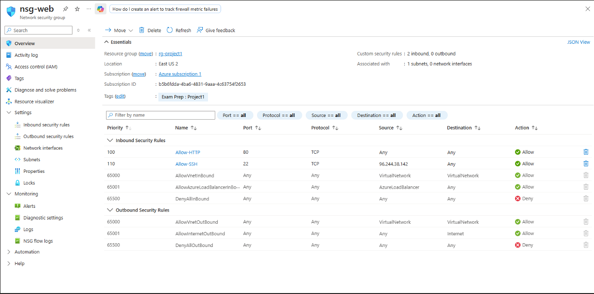
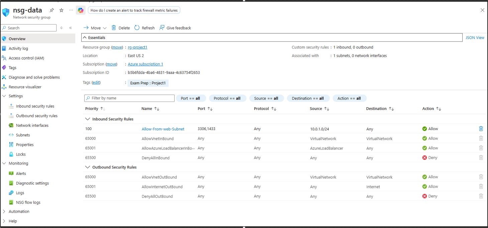
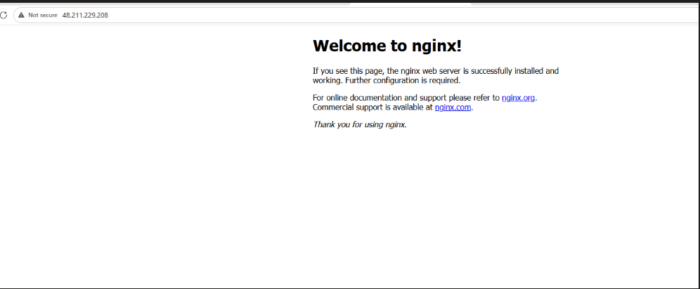
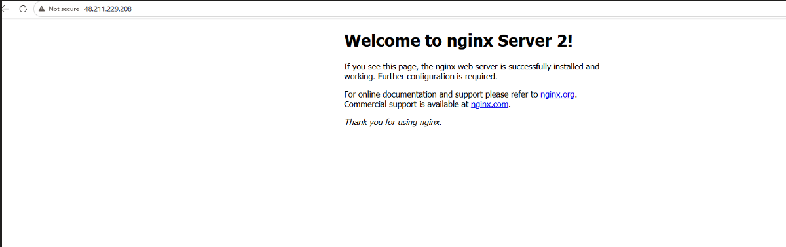
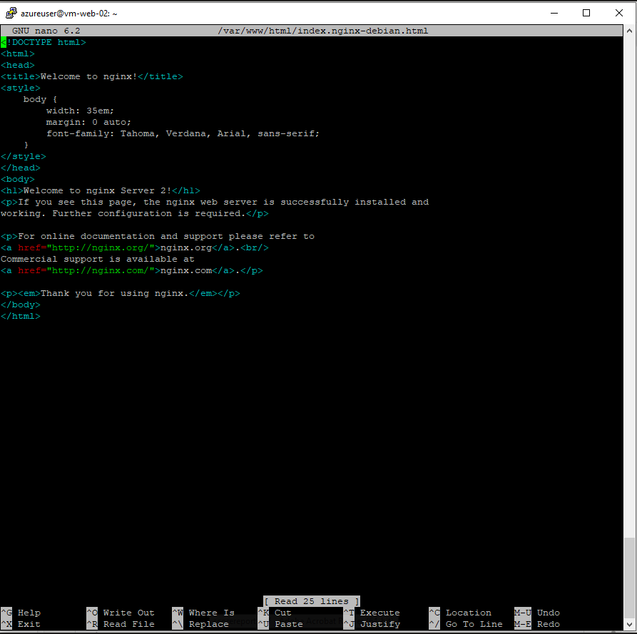
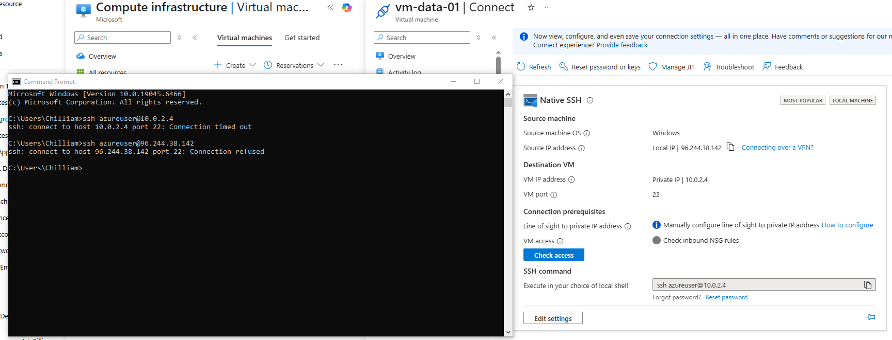
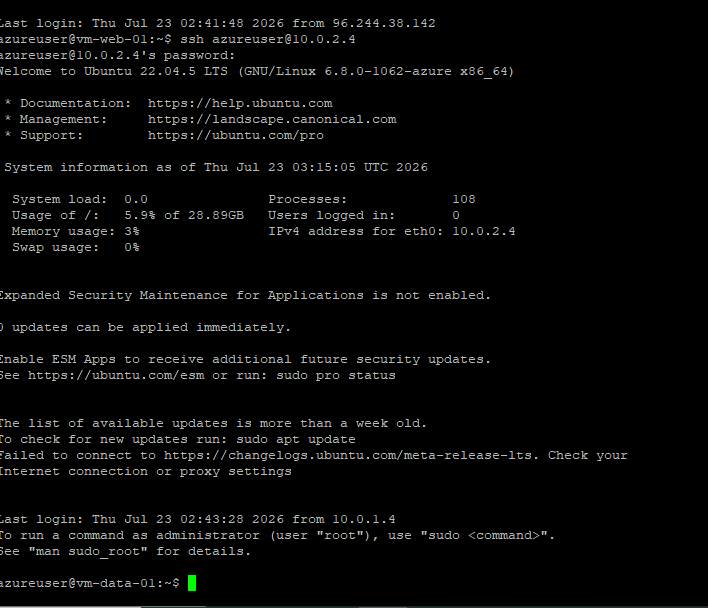

# Azure-Project-Core-Infrastructure
Collection of Azure projects.
## Network Architecture

## NSG Configuration

Web subnet NSG — allows HTTP and SSH from my IP only:

Data subnet NSG — allows only port 3306 from the web subnet, deny-all beneath it:

## Load Balancing Verification

## Network Segmentation Proof

Direct SSH to the data VM fails from my local machine; succeeds only when
routed through the web VM (jump-box pattern):

## Lessons Learned

- Standard Load Balancer backend pool membership removes default outbound
  internet access for VMs without a public IP — had to add a NAT Gateway
  to the web subnet to restore connectivity for package installation.
- Standard Load Balancer uses 5-tuple hashing rather than strict
  round-robin, so browser refreshes on the same connection can appear
  "sticky" to one backend; verified true distribution using repeated
  curl requests instead.
