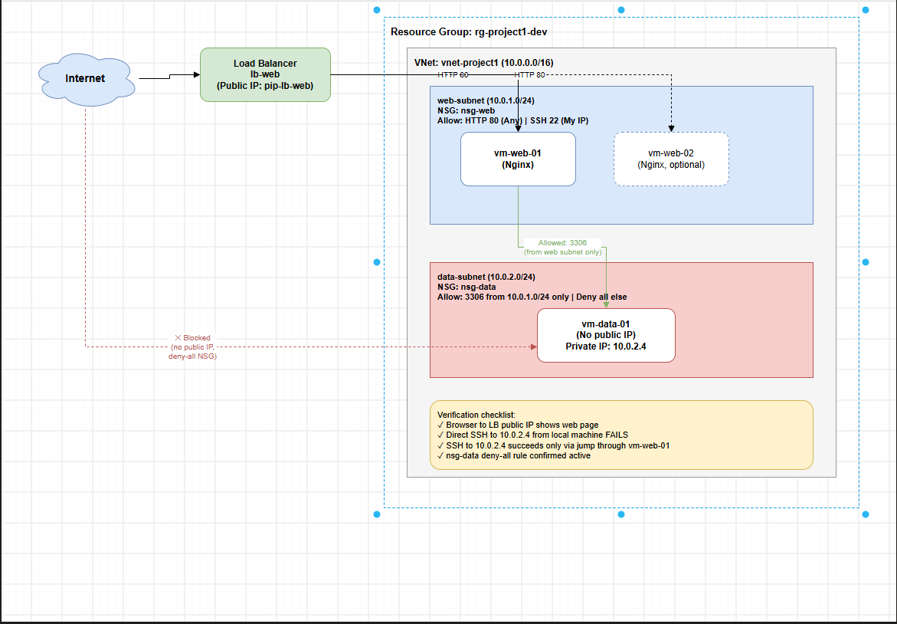
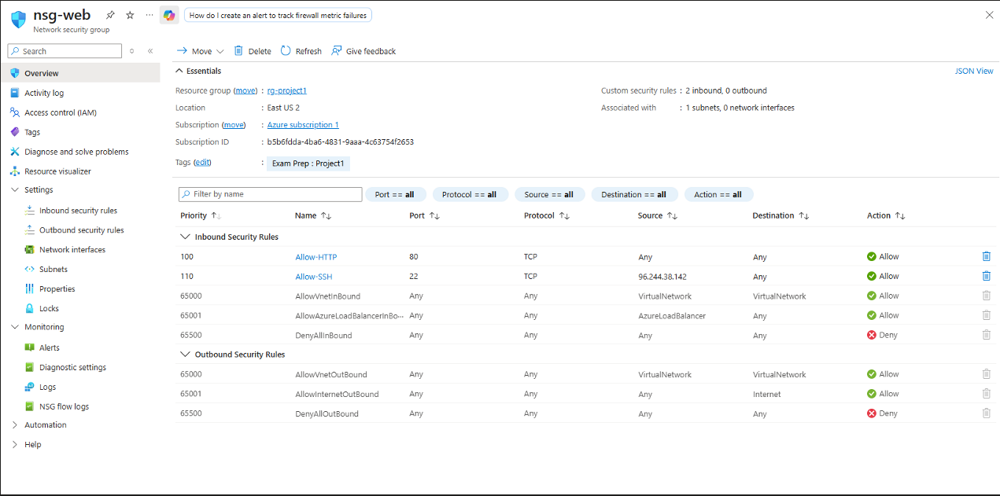
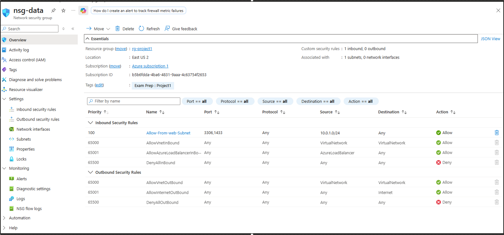
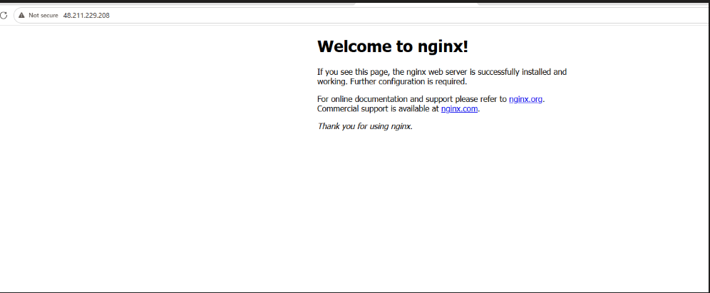
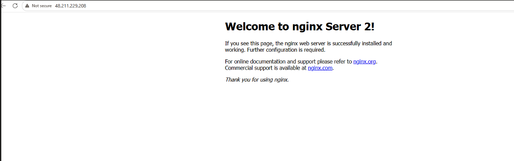
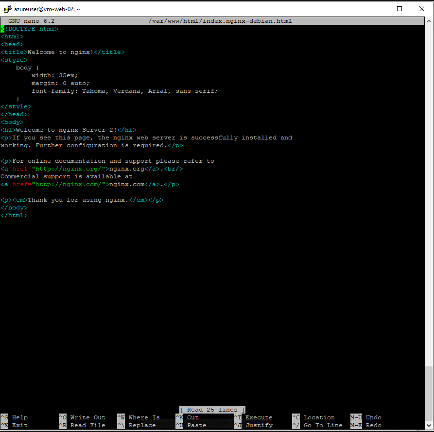
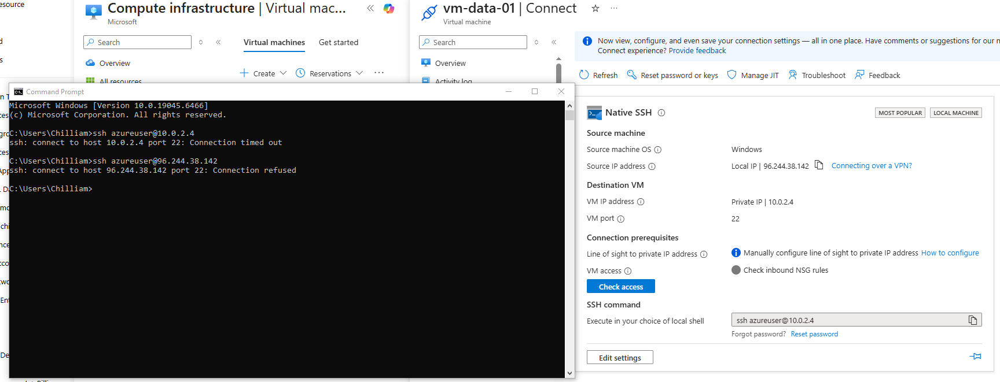
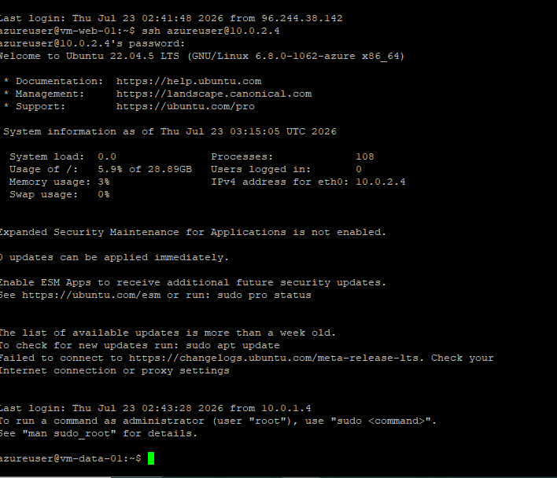

# Azure-Project-Core-Infrastructure

# Project 1: Core Infrastructure Build — README

## Overview

This project built a segmented two-tier network manually through the Azure Portal — a public-facing web tier behind a load balancer, and a private data tier with no direct internet exposure — establishing the network segmentation pattern that every later project in this series built on top of.

---

## Objectives Completed

- **Resource group and VNet** with two subnets (`web-subnet`, `data-subnet`) on distinct address ranges
- **Two NSGs**, each scoped to its own subnet, with the data-tier NSG explicitly restricted to only accept traffic from the web subnet's address range plus an explicit deny-all rule
- **Two VMs** — a public-facing web VM (Nginx) and a private data VM with no public IP at all
- **Verified network segmentation** by proving direct SSH from the local machine to the data VM fails, while SSH through the web VM (jump-box pattern) succeeds
- **Load balancer** deployed in front of the web tier, with a second web VM added afterward to demonstrate real traffic distribution
- **Documented architecture** with a network diagram and a GitHub repository containing screenshots and a written README

---

## Challenges We Ran Into (and How We Resolved Them)

### 1. SSH jump-box access repeatedly failed
**Problem:** Multiple distinct SSH failures when trying to reach the private data VM through the web VM — "Permission denied (publickey)," PuTTY's "no supported authentication methods," and later "server refused our key."
**Fix:** Diagnosed each as a separate root cause: (1) the private key was never on the jump host and shouldn't be — the real fix was **SSH agent forwarding** (`ssh -A`) so the key stays local but authentication still chains through; (2) PuTTY specifically needed the key converted to `.ppk` format via PuTTYgen, since it doesn't read OpenSSH-format keys directly; (3) a genuine key mismatch between what was loaded locally and what was actually trusted on the VM, resolved by pushing a known-good key with `az vm user update`.

### 2. Standard Load Balancer silently broke outbound internet access
**Problem:** `apt update && apt install nginx` hung indefinitely on the second web VM after it was added to the load balancer's backend pool.
**Fix:** Traced to a genuine Azure behavior, not a bug: a **Standard SKU load balancer does not provide default outbound internet access** to backend VMs without their own public IP. Resolved by adding a **NAT Gateway** to the web subnet, restoring outbound connectivity for package installation.

### 3. Load balancer traffic distribution appeared broken during manual testing
**Problem:** Repeatedly refreshing the browser against the load balancer's public IP kept showing the same backend server, appearing as if the second VM was never receiving traffic.
**Fix:** Identified this as expected behavior, not a fault — Standard Load Balancer uses **5-tuple hash-based distribution**, and browser connection reuse (HTTP keep-alive) from a single source IP/port combination naturally appears "sticky" within one browsing session. Verified true distribution using a `curl` loop generating fresh connections instead of relying on browser refreshes.

### 4. GitHub upload workflow via the web UI required a different approach than expected
**Problem:** Needed to publish screenshots and documentation without using local Git commands.
**Fix:** Used GitHub's web-based drag-and-drop upload with explicit folder-path prefixes (e.g., `screenshots/filename.png`) typed into the upload staging area, plus the web-based Markdown editor with live preview before committing.

---

## Network Architecture



## NSG Configuration

Web subnet NSG — allows HTTP and SSH from my IP only:


Data subnet NSG — allows only port 3306 from the web subnet, deny-all beneath it:


## Load Balancing Verification





## Network Segmentation Proof

Direct SSH to the data VM fails from my local machine; succeeds only when
routed through the web VM (jump-box pattern):



## What We Learned

- **Network segmentation isn't proven by configuration alone — it has to be demonstrated.** Screenshotting an NSG rule is weaker evidence than actually attempting (and failing) a direct connection, then succeeding through the intended path. This "prove it, don't just configure it" principle carried through every later project in this series.
- **Load balancer behavior around outbound connectivity is a genuinely common real-world gotcha**, not an obscure edge case — worth knowing before it costs debugging time in a live environment.
- **Apparent bugs are sometimes just unfamiliar-but-correct behavior.** The load balancer "not distributing traffic" turned out to be expected hashing/connection-reuse behavior, not a misconfiguration — a good reminder to verify with a tool built for the job (`curl` in a loop) before assuming something is broken.
- **The jump-box (bastion) pattern and agent forwarding are foundational skills**, not a one-off trick — they came up repeatedly in every subsequent project in this series whenever a VM had no public IP by design.
- Standard Load Balancer backend pool membership removes default outbound internet access for VMs without a public IP — had to add a NAT Gateway to the web subnet to restore connectivity for package installation.
- Standard Load Balancer uses 5-tuple hashing rather than strict round-robin, so browser refreshes on the same connection can appear "sticky" to one backend; verified true distribution using repeated curl requests instead.
---

## Files in This Project

```
azure-project1-core-infrastructure/
├── README.md
├── screenshots/
│   ├── network-diagram.png
│   ├── nsg-rules-web.png
│   ├── nsg-rules-data.png
│   ├── lb-response-server1.png
│   ├── lb-response-server2.png
│   └── ssh-segmentation-proof.png
```
